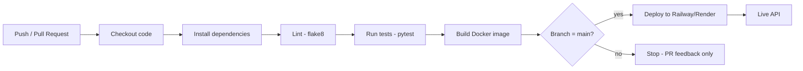

# Pipeline Diagram

**Flow summary:**
1. Every push or pull request triggers the `build-and-test` job.
2. Dependencies are installed, code is linted, and the test suite runs.
3. A Docker image is built to confirm the container is production-ready.
4. Only pushes to `main` that pass all checks trigger the `deploy` job.
5. The deploy job publishes the app to Railway or Render.
